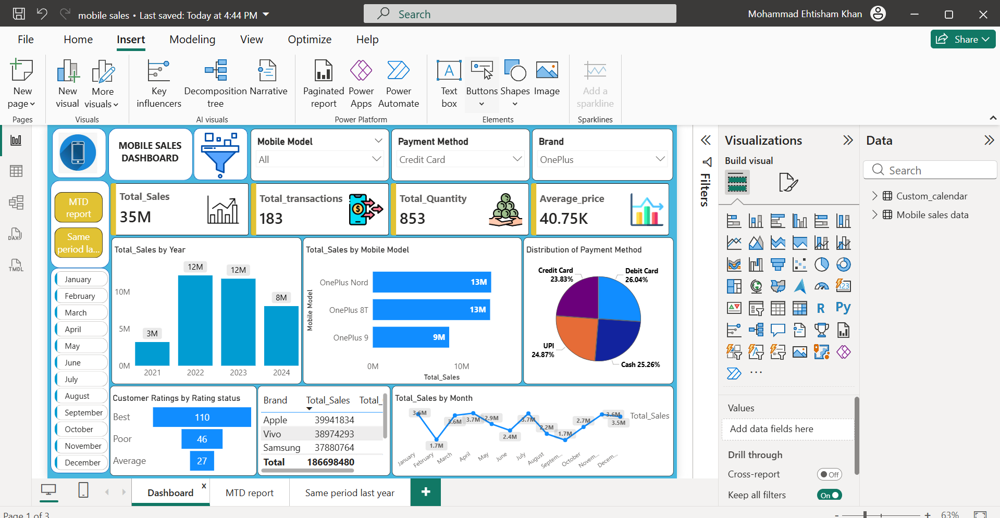
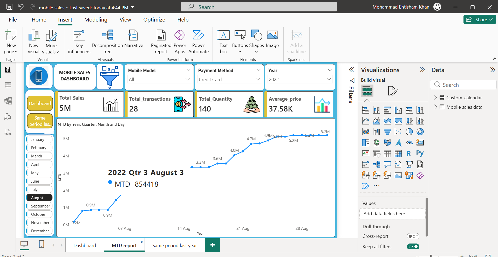
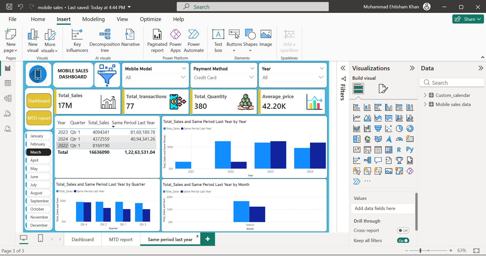

## Dashboard Preview

# Power BI – Mobile Sales Analytics Dashboard

## Business Objective
The objective of this project is to analyze mobile sales data to identify sales trends, performance drivers, and year-over-year growth.

## KPIs
- Total Sales
- Total Transactions
- Total Quantity Sold
- Average Selling Price

## Data & Modeling
- Cleaned and transformed data using Power Query
- Created a star schema data model
- Used a custom calendar table for time intelligence

## Time Intelligence
- Month-to-Date (MTD) analysis
- Same Period Last Year comparison
- Year, Quarter, Month level analysis

## Key Insights
- Sales show steady growth during festive months
- Credit Card and UPI are the most preferred payment methods
- Increase in average price positively impacts total sales
- 2023 shows better performance compared to the same period last year
- Premium mobile models contribute higher revenue with fewer transactions

## Recommendations
- Focus marketing campaigns during high-performing months
- Promote premium models to maximize revenue
- Optimize offers for digital payment methods

## Tools Used
- Power BI Desktop
- DAX
- Power Query
